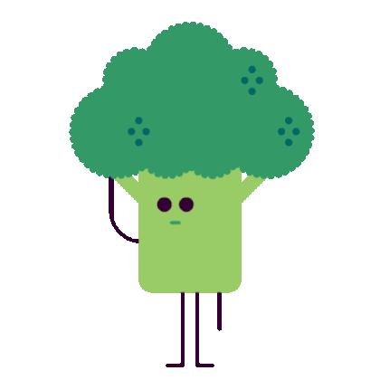
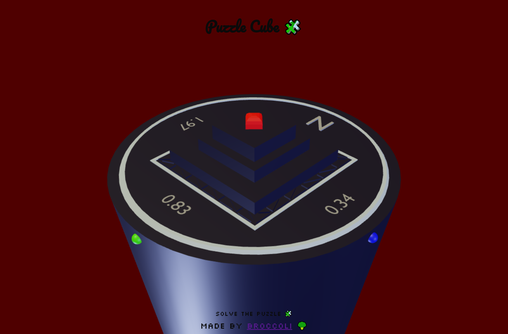
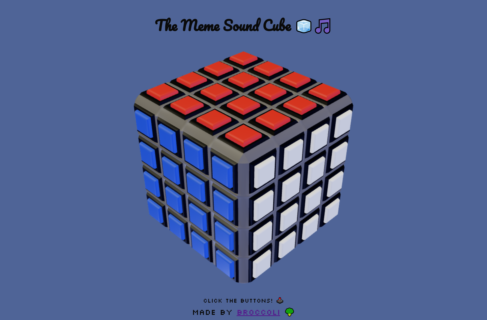
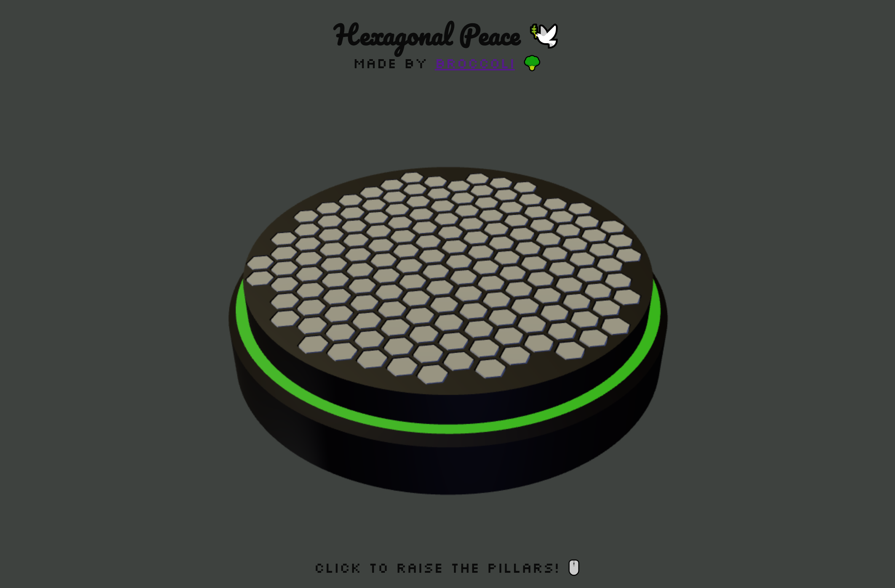
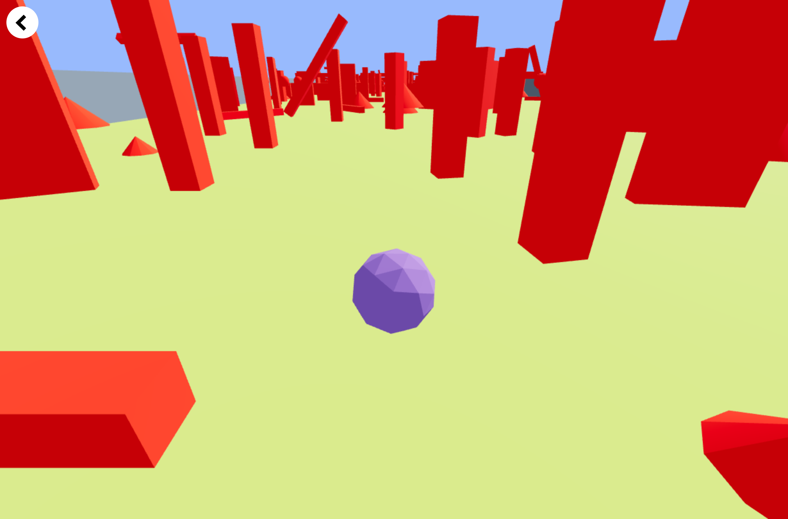
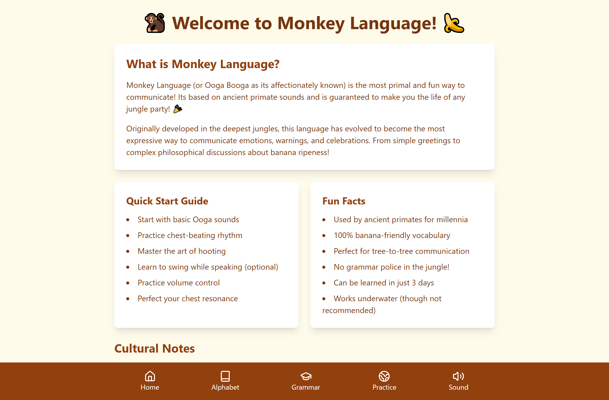
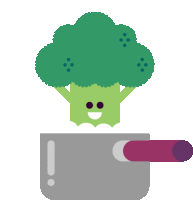

<!-- Columns Container -->
<table>
  <tr>
    <!-- Left Column -->
    <td align="left" valign="top">
      <h3 align="center">Fullstack Developer & Creative Technologist</h3>
      

        
      

      
Fullstack developer passionate about  building  immersive web  
  experiences and efficient systems.   Specialize in React/Next.js 

      

        
        
        
      

    </td>
    <!-- Right Column -->
    <td align="center" valign="top">
      <picture>
        <source
          media="(prefers-color-scheme: dark)"
          srcset="
            https://github-readme-streak-stats.herokuapp.com/?user=pgpavlides&ring_color=99cc66&fire=2cc970&sideNums=339966&currStreakLabel=99cc66&currStreakNum=2cc970&border=99cc66&background=00000000
          "
        />
        <source
          media="(prefers-color-scheme: light), (prefers-color-scheme: no-preference)"
          srcset="
            https://github-readme-streak-stats.herokuapp.com/?user=pgpavlides&ring_color=99cc66&fire=2cc970&sideNums=339966&currStreakLabel=99cc66&currStreakNum=2cc970&border=99cc66&background=ffffff00
          "
        />
        
      </picture>
        <picture align="center">
          <source
            media="(prefers-color-scheme: dark)"
            srcset="
              https://github-readme-stats.vercel.app/api?username=pgpavlides&show_icons=true&title_color=99cc66&text_color=2cc970&icon_color=339966&border_color=99cc66&bg_color=00000000&include_all_commits=true&count_private=true
            "
          />
          <source
            media="(prefers-color-scheme: light), (prefers-color-scheme: no-preference)"
            srcset="
              https://github-readme-stats.vercel.app/api?username=pgpavlides&show_icons=true&title_color=99cc66&text_color=2cc970&icon_color=339966&border_color=99cc66&bg_color=ffffff00&include_all_commits=true&count_private=true
            "
          />
          
        </picture>
        <picture>
          <source
            media="(prefers-color-scheme: dark)"
            srcset="
              https://github-readme-stats.vercel.app/api/top-langs/?username=pgpavlides&layout=compact&title_color=99cc66&text_color=2cc970&icon_color=339966&border_color=99cc66&bg_color=00000000&langs_count=6
            "
          />
          <source
            media="(prefers-color-scheme: light), (prefers-color-scheme: no-preference)"
            srcset="
              https://github-readme-stats.vercel.app/api/top-langs/?username=pgpavlides&layout=compact&title_color=99cc66&text_color=2cc970&icon_color=339966&border_color=99cc66&bg_color=ffffff00&langs_count=6
            "
          />
          
        </picture>
      
Byte sprouted in a code compost heap, his florets compiling bugs into features.   While others coded in straight lines, he grew recursive branches - solving   errors through photosynthesis logic. Now his git pushes   bloom across repositories, planting terminal wisdom in root directories.

  

    🥦
  

    </td>
  
  </tr>
</table>

---

  
  

    <h1>Technologies</h1>
    
  

  

    
  

  

    <h1>Tools</h1>
    
    
  

## 🚀 Featured Projects

<table>
  <tr>
    <td>
      
      <h3>Broccoli Creator</h3>
      

        Coding assistant application that connect's to your repository and can
        compress your repository to a single `.md` file
      

      
🛠️ Next.js, Framer Motion

      <a
        href="https://mprokolo.gr/"
        >View Live</a
      >
    </td>
    <td>
      
      <h3>Personal Portfolio</h3>
      
My personal portfolio created with Vanilla Javascript

      
🛠️ Javascript , HTML , CSS

      <a href="https://www.pgpavlides.com/">View Live</a>
    </td>
    <td>
      
      <h3>Face Galaxy</h3>
      
A galaxy where you can add your own face

      
🛠️ Javascript , Three.js

      <a href="https://face-galaxy.vercel.app/">View Live</a>
    </td>
  </tr>
</table>

  <!-- OTHER PROJECTS -->

<table>
  <!-- Row 1 -->
  <tr>
    <td>
      
      <h3>Puzzle Cube</h3>
      
Solve the cube with the riddles!

      
🛠️ Javascript, Threejs

      <a href="https://puzzlecube.vercel.app/">Play</a>
    </td>
    <td>
      
      <h3>Meme Cube</h3>
      
Press the button to   play  meme sounds!

      
🛠️ Javascript, Threejs

      <a href="https://memecube.vercel.app/">Live</a>
    </td>
    <td>
      
      <h3>Hexagonal Piece</h3>
      
Click and find peace   wit the hexagons!

      
🛠️ Javascript, Threejs

      <a href="https://hexagonalpeace.vercel.app/">Repo</a>
    </td>
    <td>
      
      <h3>Ball Game</h3>
      
⚠️ Under Heavy Development ⚠️

      
🛠️ React, React Three Fiber

      <a href="https://ball-game-v2-git-master-pgpavlides.vercel.app/">Demo</a>
    </td>
    <td>
      
      <h3>Monkey Language</h3>
      
Ever wanted to learn   to speak monkey?🍌

      
🛠️ React

      <a href="https://monkey-alphabet.vercel.app/">Play</a>
    </td>
  </tr>
</table>

  

--- 

### 🌱 Current Focus

  
  
Exploring WebAssembly performance optimizations and 3D Web experiences

--- 

### 📫 Let's Connect

 

        
      

  
  
  

