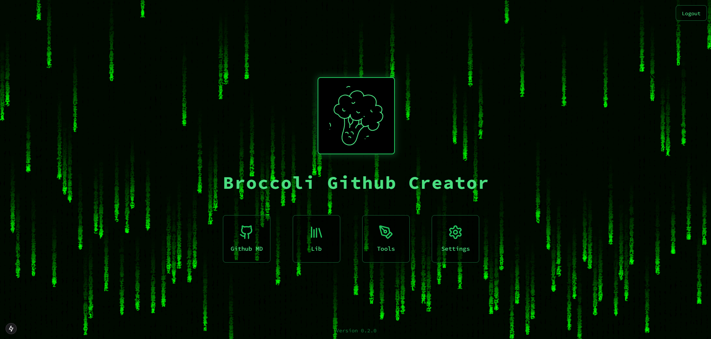
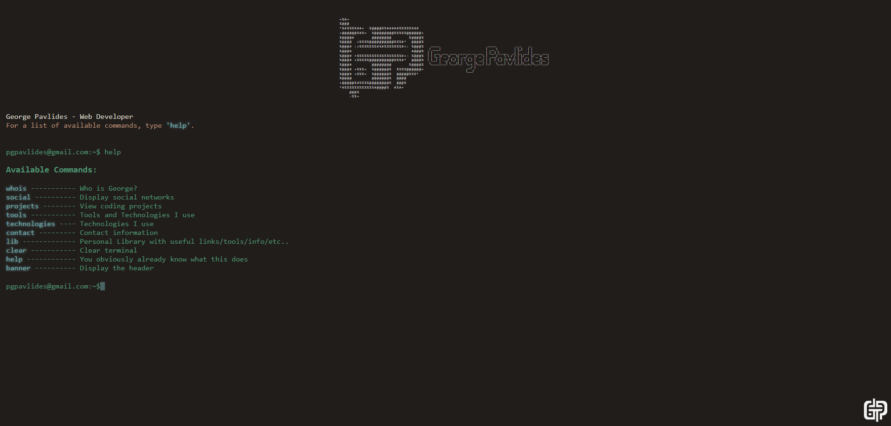
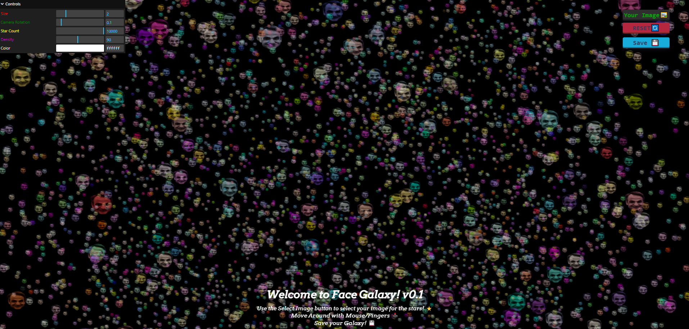

<h3 align="center">Fullstack Developer & Creative Technologist</h3>

  

  <!-- Social Badges -->
  
  
  

---

### 🛠️ Technology Stack

**Frontend Development**  

  

**Backend & Databases**  

  

**Tools & Platforms**  

  

---

## 🚀 Featured Projects

<table style="width:100%; border-collapse: collapse; text-align: center;">
  <tr>
    <td style="padding: 15px; border: 1px solid #ddd;">
      
      <h3 style="margin-top: 10px; font-size: 18px; color: #333;">Broccoli Creator</h3>
      
Coding assistant application that connect's to your repository and can compress your repository to a single `.md` file

      
🛠️ Next.js, Framer Motion (NOT LIVE)

      <a href="https://github.com/pgpavlides/mprokolo" style="display: inline-block; padding: 8px 12px; background-color: #007bff; color: white; text-decoration: none; border-radius: 5px; margin-top: 5px;">View Live</a>
    </td>
    <td style="padding: 15px; border: 1px solid #ddd;">
      
      <h3 style="margin-top: 10px; font-size: 18px; color: #333;">Personal Portfolio</h3>
      
My personal portfolio created with Vanilla Javascript

      
🛠️ Javascript , HTML , CSS

      <a href="https://www.pgpavlides.com/" style="display: inline-block; padding: 8px 12px; background-color: #007bff; color: white; text-decoration: none; border-radius: 5px; margin-top: 5px;">View Live</a>
    </td>
    <td style="padding: 15px; border: 1px solid #ddd;">
      
      <h3 style="margin-top: 10px; font-size: 18px; color: #333;">Face Galaxy</h3>
      
A galaxy where you can add your own face 

      
🛠️ Javascript , Three.js 

      <a href="https://face-galaxy.vercel.app/" style="display: inline-block; padding: 8px 12px; background-color: #007bff; color: white; text-decoration: none; border-radius: 5px; margin-top: 5px;">View Live</a>
    </td>
  </tr>
</table>

### 📈 GitHub Analytics

  
  
  

---

### 🌱 Current Focus

  
  
Exploring WebAssembly performance optimizations and 3D Web experiences

---

### 📫 Let's Connect

  
  
  

