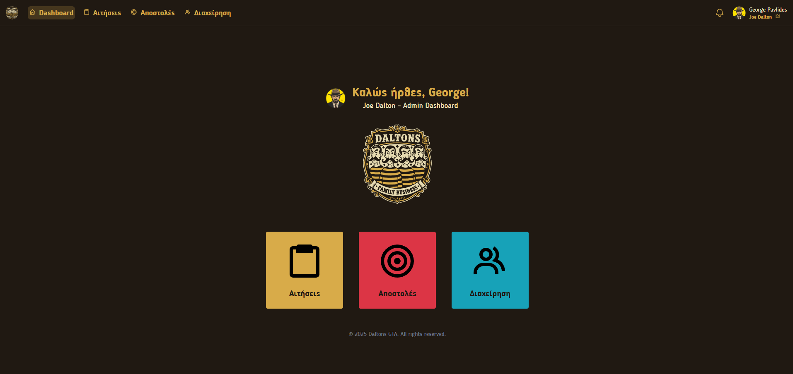
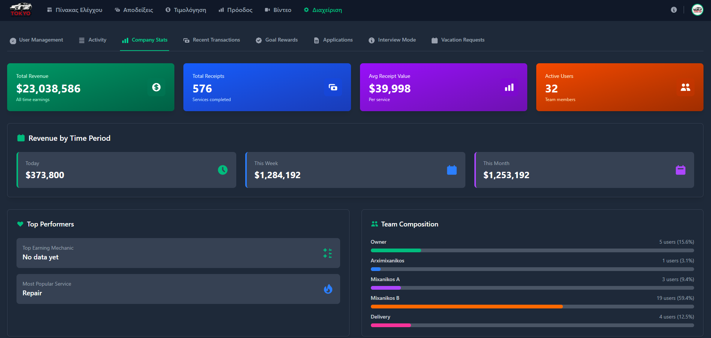
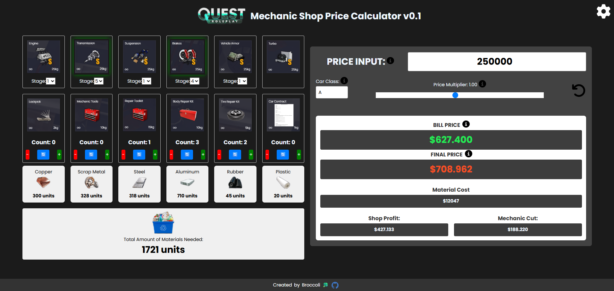

<!-- Columns Container -->
<table>
  <tr>
    <!-- Left Column -->
    <td align="left" valign="top">
      <h3 align="center">Fullstack Developer & Creative Technologist</h3>
      

        
      

      
Fullstack developer passionate about  building  immersive web  
  experiences and efficient systems.   Specialize in React/Next.js, CMS Architecture,  and Enterprise Application Development.

      

        
        
        
      

    </td>
    <!-- Right Column -->
    <td align="center" valign="top">
      <picture>
        <source
          media="(prefers-color-scheme: dark)"
          srcset="
            https://github-readme-streak-stats.herokuapp.com/?user=pgpavlides&ring_color=99cc66&fire=2cc970&sideNums=339966&currStreakLabel=99cc66&currStreakNum=2cc970&border=99cc66&background=00000000
          "
        />
        <source
          media="(prefers-color-scheme: light), (prefers-color-scheme: no-preference)"
          srcset="
            https://github-readme-streak-stats.herokuapp.com/?user=pgpavlides&ring_color=99cc66&fire=2cc970&sideNums=339966&currStreakLabel=99cc66&currStreakNum=2cc970&border=99cc66&background=ffffff00
          "
        />
        
      </picture>
        <picture align="center">
          <source
            media="(prefers-color-scheme: dark)"
            srcset="
              https://github-readme-stats.vercel.app/api?username=pgpavlides&show_icons=true&title_color=99cc66&text_color=2cc970&icon_color=339966&border_color=99cc66&bg_color=00000000&include_all_commits=true&count_private=true
            "
          />
          <source
            media="(prefers-color-scheme: light), (prefers-color-scheme: no-preference)"
            srcset="
              https://github-readme-stats.vercel.app/api?username=pgpavlides&show_icons=true&title_color=99cc66&text_color=2cc970&icon_color=339966&border_color=99cc66&bg_color=ffffff00&include_all_commits=true&count_private=true
            "
          />
          
        </picture>
        <picture>
          <source
            media="(prefers-color-scheme: dark)"
            srcset="
              https://github-readme-stats.vercel.app/api/top-langs/?username=pgpavlides&layout=compact&title_color=99cc66&text_color=2cc970&icon_color=339966&border_color=99cc66&bg_color=00000000&langs_count=6
            "
          />
          <source
            media="(prefers-color-scheme: light), (prefers-color-scheme: no-preference)"
            srcset="
              https://github-readme-stats.vercel.app/api/top-langs/?username=pgpavlides&layout=compact&title_color=99cc66&text_color=2cc970&icon_color=339966&border_color=99cc66&bg_color=ffffff00&langs_count=6
            "
          />
          
        </picture>
      
Hey, I'm <strong>George Pavlides</strong> — a fullstack developer from Greece   who turns ideas into fast, polished web experiences.   I love building things that work well and look even better,   from CMS architectures to 3D interactive apps.

  

    🥦
  

    </td>
  
  </tr>
</table>

---

  <h1>🧑‍💻 Tech Stack</h1>

  <h3>⚡ Frontend</h3>
  
   
  

 

  <h3>🗄️ Backend & Databases</h3>
  
   
  

 

  <h3>🛠️ DevOps & Tools</h3>
  
   
  

 

  <h3>🎨 Design & Creative</h3>
  

---

## 💼 Professional Experience Highlights

<table>
  <tr>
    <td>🏗️</td>
    <td><strong>Custom CMS + Next.js Frontend System</strong></td>
    <td>Architected and built a complete WordPress CMS backend with a Next.js frontend from scratch in 2 months — now powering 6 live production sites with pixel-perfect design implementation.</td>
  </tr>
  <tr>
    <td>⚡</td>
    <td><strong>Admin Application Refactor — 3x Performance Boost</strong></td>
    <td>Solo-refactored an enterprise admin application in 2 months (previously took another developer 1 year). Handled design, layout, UI, implementation, and testing — delivering 3x faster performance.</td>
  </tr>
  <tr>
    <td>☕</td>
    <td><strong>Legacy Java Backend Refactor</strong></td>
    <td>Refactored an aging Java backend, significantly improving application speed and reliability across the platform.</td>
  </tr>
  <tr>
    <td>🔧</td>
    <td><strong>AnyDesk Connection Tool</strong></td>
    <td>Designed and deployed an internal tool for the team to seamlessly connect to AnyDesk machines distributed worldwide.</td>
  </tr>
  <tr>
    <td>🚀</td>
    <td><strong>Deploy Automation System</strong></td>
    <td>Created a deployment automation application covering all project locations, streamlining the release pipeline.</td>
  </tr>
  <tr>
    <td>🤖</td>
    <td><strong>AI Productivity Integration</strong></td>
    <td>Introduced AI-driven workflows to the team, boosting overall productivity by 2–3x through training and tooling guidance.</td>
  </tr>
  <tr>
    <td>🎧</td>
    <td><strong>Ongoing Client Support</strong></td>
    <td>Providing continuous client support and troubleshooting throughout the week, ensuring uptime and satisfaction.</td>
  </tr>
</table>

---

## 🚀 Featured Projects

<table>
  <tr>
    <td>
      
      <h3>Broccoli Creator</h3>
      

        Coding assistant application that connect's to your repository and can
        compress your repository to a single `.md` file
      

      
🛠️ Next.js, Framer Motion

      <a
        href="https://mprokolo.gr/"
        >View Live <--- 🔗 </a
      >
      <a
        href="https://github.com/pgpavlides/mprokolo"
        > ---> View Repository</a
      >      
    </td>
    <td>
      
      <h3>Personal Portfolio</h3>
      
My personal portfolio created with Vanilla Javascript

      
🛠️ Javascript , HTML , CSS

      <a href="https://www.pgpavlides.com/">View Live</a>
    </td>
    <td>
      
      <h3>Face Galaxy</h3>
      
A galaxy where you can add your own face

      
🛠️ Javascript , Three.js

      <a href="https://face-galaxy.vercel.app/">View Live</a>
    </td>
  </tr>
</table>

  <!-- OTHER PROJECTS -->

<table>
  <!-- Row 1 -->
  <tr>
    <td>
      
      <h3>Puzzle Cube</h3>
      
Solve the cube with the riddles!

      
🛠️ Javascript, Threejs

      <a href="https://puzzlecube.vercel.app/">Play</a>
    </td>
    <td>
      
      <h3>Meme Cube</h3>
      
Press the button to   play  meme sounds!

      
🛠️ Javascript, Threejs

      <a href="https://memecube.vercel.app/">Live</a>
    </td>
    <td>
      
      <h3>Hexagonal Piece</h3>
      
Click and find peace   wit the hexagons!

      
🛠️ Javascript, Threejs

      <a href="https://hexagonalpeace.vercel.app/">Repo</a>
    </td>
    <td>
      
      <h3>Ball Game</h3>
      
⚠️ Under Heavy Development ⚠️

      
🛠️ React, React Three Fiber

      <a href="https://ball-game-v2-git-master-pgpavlides.vercel.app/">Demo</a>
    </td>
    <td>
      
      <h3>Monkey Language</h3>
      
Ever wanted to learn   to speak monkey?🍌

      
🛠️ React

      <a href="https://monkey-alphabet.vercel.app/">Play</a>
    </td>
  </tr>
</table>

## 🎭 Roleplaying Projects

<table>
  <tr>
    <td>
      
      <h3>Mafia Management System</h3>
      

        Complete management system for roleplaying communities featuring Discord integration, 
        mission assignment with interactive maps and pins, member statistics tracking, 
        and user management through Discord.
      

      
🛠️ Discord.js, Supabase, Node.js, Interactive Maps

      
📊 Features: Mission Tracking, Member Stats, Discord Bot Integration

      <a href="https://daltons.gr/">View Live</a>
    </td>
    <td>
      
      <h3>Mechanic Shop Management System</h3>
      

        Advanced shop management system for gaming communities with receipt tracking, 
        economic analytics, Discord connectivity, and support for managing up to 2 
        mechanic shops simultaneously with detailed financial insights.
      

      
🛠️ Discord.js, Supabase, Node.js, Analytics Dashboard

      
📈 Features: Sales Tracking, Economic Stats, Multi-Shop Support

      <a href="https://tokyomechanic.gr/">View Live</a>
    </td>
    <td>
      
      <h3>Mechanic Shop Calculator</h3>
      

        Advanced calculation tool for mechanic shops with comprehensive car parts 
        management and receipt generation. Features detailed pricing calculations 
        and parts inventory tracking for roleplaying communities.
      

      
🛠️ React, Node.js, Database Integration

      
🔧 Features: Advanced Calculations, Car Parts Management, Receipt Generation

    </td>
  </tr>
</table>

--- 

### 🌱 Current Focus

  
  
Exploring WebAssembly performance optimizations and 3D Web experiences

--- 

### 📫 Let's Connect

 

        
      

  
  
  

